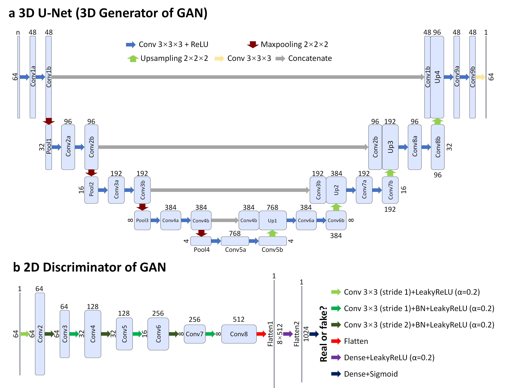

# Diffusion MRI data analysis assisted by deep learning synthesized anatomical images (DeepAnat) 
Keras implementation for DeepAnat

## 1. Pipeline

**Figure 1. DeepAnat pipeline.** DeepAnat utilizes convolutional neural networks (CNNs) to transfer diffusion data to anatomical data, which can provide accurate cortical surface and brain segmentations to facilitate diffusion analysis such as region-specific analysis, surface-based analysis, tractography, and structural connectivity analysis when native anatomical data are unavailable.

## 2. Input formulation

**Figure 2. Network input and output.** The input of the network includes: the mean b = 0 image volume (rows a–c, column ii), the mean DWI (rows a–c, column iii) volume, three volumes of diffusion tensor eigenvalues (ADC1, ADC2, ADC3) (rows a–c, columns iv–vi) and six DWI volumes along optimized diffusion directions (displayed above each DWI) computed from fitted tensors (rows d–f). The output of the network is the acquired T1w image volume (rows a–c, column i). Magnified views of basal ganglia (rows b, e, yellow boxes) and visual cortex (rows c, f, red boxes) are displayed with arrowheads highlighting the boundary of gray matter and white matter (blue and magenta) and the claustrum (green). The images are from a representative subject of the HCP data. 

## 3. Network architecture

**Figure 3. Network architecture.** The 5-level 3D U-Net (a) maps *n*-channel diffusion image volumes (64×64×64×*n* voxels) to a T1w image volume (64×64×64 voxels). The GAN consists of a 3D generator (the 3D U-Net in a) and a 2D discriminator (b). The 2D discriminator adopts the discriminator of SRGAN, with spectral normalization incorporated in each layer to stabilize training. The input of the discriminator is an axial, coronal, or sagittal image (64×64 pixels) from the T1w image volume synthesized by the generator or the native T1w image volume. The output of the discriminator is a probability value of the input image being classified as a real T1w image. The sizes of feature maps are listed (the spatial size on the right or left and the number of channels on the top or at the bottom). The abbreviation Conv stands for convolution and BN stands for batch normalization.

## 4. Image results

**Figure 4. Image results.** Exemplar image slices from the native T1w image volume (i), mean DWI volume (ii), T1w image volumes synthesized by U-Net (iii) and GAN (iv), and residual volumes between the synthesized and native T1w volumes (iv, vi) of a representative subject from the HCP data, with enlarged regions in the occipital lobe with diminished gray matter-white matter contrasts (b, magenta arrow heads) as well as in the frontal (d) and temporal lobe (f) with severe image artifacts (blue arrow heads). The mean squared error (MSE) and VGG perceptual loss (VGG) are listed to quantify the similarity between the synthesized and native T1w image volumes.

## 5. Tutorial

- DeepAnat is implemented and open-sourced in Google Colab. Please use the link below to access the corresponding Google Drive: https://drive.google.com/drive/folders/1QgG2isRWXYdZU7CxoaS3R9NyexvQ1N2r?usp=sharing.
- The whole pipeline to train and fine-tune the 3D U-Net is contained in the *DeepAnat.ipynb* notebook. The codes to train the hybrid GAN can be found in *s_DeepAnat_trainGAN.py*. More details regarding this hybrid GAN can be found at https://github.com/liziyu0929/HDnGAN. 

## 6. Reference

[1] Li, Z., Fan, Q., Bilgic, B., Wang, G., Wu, W., Polimeni, J. R., Huang, S. Y., & Tian, Q. (2023). Diffusion MRI data analysis assisted by deep learning synthesized anatomical images (DeepAnat). *Medical Image Analysis*, 102744.
[2]  Li, Z., Fan, Q., Bilgic, B., Wang, G., Polimeni, J. R., Huang, S. Y., Tian, Q. (2022). Diffusion MRI data analysis assisted by deep learning synthesized anatomical images (DeepAnat) (ISMRM 2022 (*Oral Presentation*)).

